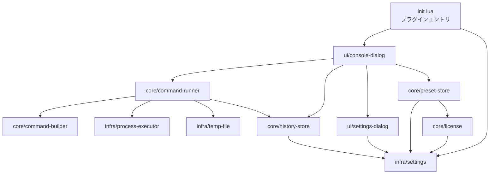

# 技術仕様書 (Architecture Design Document)

> 本書は PRD(`docs/product-requirements.md`)と機能設計書(`docs/functional-design.md`)を
> 技術的に実現するためのシステム構造・技術選定・非機能設計を定義する。

## テクノロジースタック

### 言語・ランタイム

| 技術 | バージョン | 備考 |
|------|-----------|------|
| Lua | 5.4 | Aseprite に組み込まれたインタプリタ。Aseprite拡張で唯一サポートされる言語 |
| Aseprite | v1.3.7 以降 | 動作対象アプリ。下記「技術的制約」を参照 |
| Aseprite Scripting API | Aseprite v1.3 系のAPI | `Dialog`, `app.fs`, `plugin`, `os.execute` 等 |

**Aseprite v1.3.7 を最小要件とする理由**:
Aseprite は `os.execute` をセキュリティラッパーで上書きしている。v1.3.6 以前は
ラッパーが戻り値を返さず常に `nil` になるため、終了コードを取得できない。
v1.3.7 でラッパーが本来の `os.execute` の戻り値を返すよう修正された。
本プロダクトは終了コードによる成否判定が必須のため、v1.3.7 を下限とする。

### フレームワーク・ライブラリ

| 技術 | バージョン | 用途 | 選定理由 |
|------|-----------|------|----------|
| Aseprite `Dialog` API | 本体付属 | パネル・設定UIの構築 | Aseprite拡張で利用できる唯一の標準UI手段 |
| Aseprite Plugin API(`init`/`exit`) | 本体付属 | メニューコマンド登録・設定永続化 | 拡張をメニューに常駐させ、`plugin.preferences` で設定を保存できる |
| Lua標準 `os` / `io` | Lua 5.4付属 | コマンド実行・一時ファイルI/O | 外部依存を増やさず実現可能 |

> ランタイムライブラリの外部依存は持たない。Aseprite に同梱されない
> 外部Luaモジュールは拡張に同梱できないため使用しない。

### 開発ツール

| 技術 | バージョン | 用途 | 選定理由 |
|------|-----------|------|----------|
| busted | 2.x | ユニットテスト | Lua標準のテストフレームワーク。Asepriteランタイム外でロジックを検証 |
| luacheck | 0.26+ | 静的解析・Lint | 未定義変数・未使用変数等を検出。コード品質を担保 |
| 7-Zip / PowerShell `Compress-Archive` | 任意 | `.aseprite-extension`(ZIP)へのパッケージング | 追加依存なしでパッケージ生成が可能 |
| Aseprite v1.3.7+ 実機 | - | 統合テスト・動作確認 | `os.execute`・UIは実機でしか検証できない |

> 開発ツールは**任意導入**(MVPでは busted/luacheck 無しでも開発可能)。
> ただし `CommandBuilder` のクオート処理は不具合が混入しやすいため busted の利用を強く推奨する。

## アーキテクチャパターン

### レイヤードアーキテクチャ

3層構成とし、依存方向を上位→下位の一方向に保つ。

```
┌─────────────────────────────────┐
│  UIレイヤー (ui/)                │ ← Dialog構築、ユーザー操作受付、結果表示
├─────────────────────────────────┤
│  コアレイヤー (core/)            │ ← コマンド生成・実行統括・履歴・Pro機能
├─────────────────────────────────┤
│  インフラレイヤー (infra/)       │ ← os.execute・一時ファイル・設定永続化
└─────────────────────────────────┘
        ↓ 依存方向は常に下向き
```

#### UIレイヤー
- **責務**: `Dialog` の構築、ユーザー入力の受付・バリデーション、結果の表示
- **許可される操作**: コアレイヤーの呼び出し
- **禁止される操作**: インフラレイヤーへの直接アクセス、`os.execute` の直接呼び出し

#### コアレイヤー
- **責務**: ビジネスロジック(コマンド生成、実行フロー統括、履歴管理、Pro機能判定)
- **許可される操作**: インフラレイヤーの呼び出し
- **禁止される操作**: UIレイヤーへの依存、`Dialog` の生成

#### インフラレイヤー
- **責務**: 外部世界とのやり取り(`os.execute`、ファイルI/O、`plugin.preferences`)
- **許可される操作**: Lua標準ライブラリ・Aseprite APIへのアクセス
- **禁止される操作**: ビジネスロジックの実装

### モジュール構成と依存関係



### 拡張機能のエントリポイント

Aseprite Plugin API を用い、`init.lua` でメニューコマンドを登録する。

```lua
-- init.lua(概念)
function init(plugin)
  Settings.init(plugin)              -- plugin.preferences を初期化
  plugin:newCommand{
    id = "asecli_open_console",
    title = "CLI Console",
    group = "file_scripts",          -- 配置するメニューグループ
    onclick = function() ConsoleDialog.show() end,
  }
end

function exit(plugin) end            -- 後始末(必要に応じて)
```

## データ永続化戦略

### ストレージ方式

| データ種別 | ストレージ | フォーマット | 理由 |
|-----------|----------|-------------|------|
| 設定(Settings) | `plugin.preferences` | Luaテーブル | Asepriteがプラグイン単位で自動永続化。独自ファイル管理が不要 |
| コマンド履歴 | `plugin.preferences` | Luaテーブル配列 | 設定と同じ仕組みで保存。上限100件で肥大化を防止 |
| プリセット(Pro) | `plugin.preferences` | Luaテーブル配列 | 同上 |
| コマンド出力(一時) | 一時ファイル | プレーンテキスト | `os.execute` の標準出力を回収する唯一の手段。回収後すぐ削除 |

### バックアップ戦略

- **設定・履歴・プリセット**: `plugin.preferences` は Aseprite が管理するため、独自バックアップは行わない
- **一時ファイル**: 永続データではないため対象外。実行完了後ただちに削除し、削除失敗時も次回起動時にクリーンアップする
- **想定リスク**: `plugin.preferences` が破損した場合は設定が初期化されるが、ユーザーデータ(スプライト)には影響しない

## パフォーマンス要件

### レスポンスタイム

| 操作 | 目標時間 | 測定環境 |
|------|---------|---------|
| コンソールパネルの表示 | 500ms以内 | Core i5相当・メモリ8GB・SSD |
| コマンド送出オーバーヘッド(入力確定〜別プロセス起動) | 200ms以内 | 同上(実際のバッチ処理時間はAseprite本体に依存し対象外) |
| 出力ログのスクロール | 10,000行で体感1秒以内 | 同上 |

> **重要な制約**: `os.execute` は同期的でプロセス終了まで待機する。
> その間 Aseprite の UI はブロックされる。`aseprite -b` の一般的な
> バッチ処理は通常1秒未満で完了するため許容範囲とする。

### リソース使用量

| リソース | 上限 | 理由 |
|---------|------|------|
| メモリ | 拡張起因で +20MB 以内 | 履歴・ログを上限管理し肥大化を防ぐ |
| ディスク | 一時ファイルは実行中のみ・1MB程度 | 回収後ただちに削除 |

## セキュリティアーキテクチャ

### データ保護

- **暗号化**: 機密データを保持しないため暗号化は行わない
- **アクセス制御**: `plugin.preferences` は Aseprite のユーザープロファイル配下に保存され、OSのユーザー権限で保護される
- **機密情報管理**: ライセンスキー以外の機密情報は扱わない。ライセンスキーはコード内にハードコードしない

### 入力検証

- **バリデーション**: コマンド未入力・実行ファイルパス未設定/不正・作業ディレクトリ不在を実行前に検証
- **サニタイゼーション**: 拡張が付加する部分(実行ファイルパス・一時ファイルパス・`cd` 引数)は必ずクオートする。Windowsのcmdでは、内部にクオートを含むコマンド全体をさらにクオートで囲む必要があるため、`CommandBuilder` がこの規則を一元的に処理する
- **エラーハンドリング**: エラーメッセージに内部パス等を最小限しか含めず、原因と対処を明示する

### 実行モデルのセキュリティ前提

- 本拡張は「ユーザーが入力した Aseprite CLI コマンドを、ユーザーの操作で実行する」ツールである。任意コマンド実行のリスクはユーザー自身が負う
- Aseprite のセキュリティ許可ダイアログ(`os.execute` 実行時)を回避・抑制する処理は実装しない
- ネットワーク通信・テレメトリは行わない

## スケーラビリティ設計

### データ増加への対応

- **履歴**: 上限100件のFIFO。古い履歴を自動削除し `plugin.preferences` の肥大化を防ぐ
- **出力ログ**: 表示行数に上限を設け、超過分を破棄
- **プリセット(Pro)**: 実用上数十件を想定。上限は設けないが、一覧UIはスクロール可能にする

### 機能拡張性

- **レイヤー分離**: UIを差し替えても `core/` が再利用できる構造とし、将来の「フォーム型ランチャー」(PRD 機能10)に備える
- **Pro機能の分離**: Pro機能(`preset-store`, `license`)を独立モジュールとし、`LicenseManager.isPro()` で一元的にゲートする
- **OS抽象化**: OS依存(クオート規則・`cd` 構文・一時パス)を `CommandBuilder` と `infra/` に閉じ込め、将来の macOS/Linux 対応(PRD 機能11)を局所的な変更で済むようにする

## テスト戦略

### ユニットテスト
- **フレームワーク**: busted
- **対象**: `CommandBuilder`、`HistoryStore` 等の純粋ロジック。Aseprite API はモックで差し替える
- **カバレッジ目標**: `core/` のロジックモジュールで 80% 以上

### 統合テスト
- **方法**: Aseprite v1.3.7 実機に拡張をインストールし、手動シナリオで検証
- **対象**: `ProcessExecutor`(`os.execute` の実挙動)、`CommandRunner`、UIダイアログ

### E2Eテスト(手動)
- **シナリオ**: PRDの受け入れ条件・機能設計書の受け入れシナリオに沿った手動確認
- **対象環境**: Windows(主対象)。将来 macOS/Linux を追加

## 技術的制約

### 環境要件
- **OS**: Windows(主対象)。macOS/Linux は将来対応(PRD 機能11)
- **対象アプリ**: Aseprite v1.3.7 以降
- **必要ディスク容量**: 拡張本体は1MB未満。実行中の一時ファイルで+1MB程度
- **必要な外部依存**: なし(ランタイムは Aseprite に同梱されるもののみ)

### パフォーマンス制約
- `os.execute` は同期実行であり、実行中は Aseprite UI がブロックされる。長時間コマンドの非同期実行は MVP では対象外
- `io.popen` は Aseprite 環境で不安定なため使用しない。出力取得は一時ファイル経由に統一する

### セキュリティ制約
- `os.execute` 実行時に Aseprite のセキュリティ許可ダイアログが表示される。これを抑制する手段は提供しない(ユーザーが「完全に信頼」を選択すれば以降は抑制される)
- Aseprite の `Dialog` API には複数行テキスト入力欄・本物のターミナルウィジェットが無く、出力表示は `label` 群または `canvas` 描画で代替する

## 依存関係管理

| 依存 | 用途 | バージョン管理方針 |
|------|------|-------------------|
| Aseprite Scripting API | ランタイム | 動作確認済みバージョン(v1.3.7+)を `package.json` と本書に明記。v1.3系の範囲で追従 |
| busted(開発時のみ) | テスト | 範囲指定で追従。配布物には含めない |
| luacheck(開発時のみ) | Lint | 範囲指定で追従。配布物には含めない |

> ランタイム依存はゼロ(Aseprite同梱機能のみ)。`.aseprite-extension`
> パッケージには `src/` のLuaソースと `package.json` のみを含め、開発ツールは含めない。

## フリーミアム / 配布アーキテクチャ

### 配布形態

- **無料版**: itch.io で無料ダウンロード。基本機能(コマンド実行・出力表示・履歴)を提供
- **Pro版**: itch.io で有料ダウンロード。プリセット等の追加機能を有効化

### Pro機能の有効化方式

| 方式 | 内容 | 採否 |
|------|------|------|
| 別ビルド配布(MVP採用) | 無料版/Pro版を別の `.aseprite-extension` として配布。Pro版ビルドは `LicenseManager.isPro()` が常に true を返す | **MVPで採用**。ライセンスサーバ不要で最も単純。itch.io が決済を担う |
| ライセンスキー方式 | 単一ビルドにキー入力欄を設け、オフライン検証(署名キー等)で機能解放 | 将来検討。海賊版耐性は別ビルドと大差なく、MVPでは過剰 |

> MVPでは「別ビルド配布」を採用する。無料版のコードには Pro 機能の
> モジュールを含めず、`LicenseManager.isPro()` が false を返すことで
> Pro UI をアップグレード誘導に切り替える。
