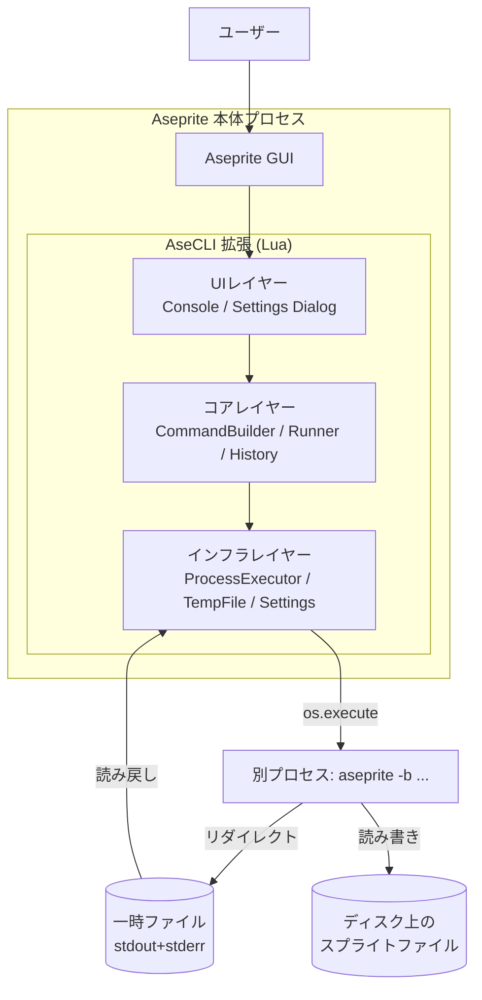
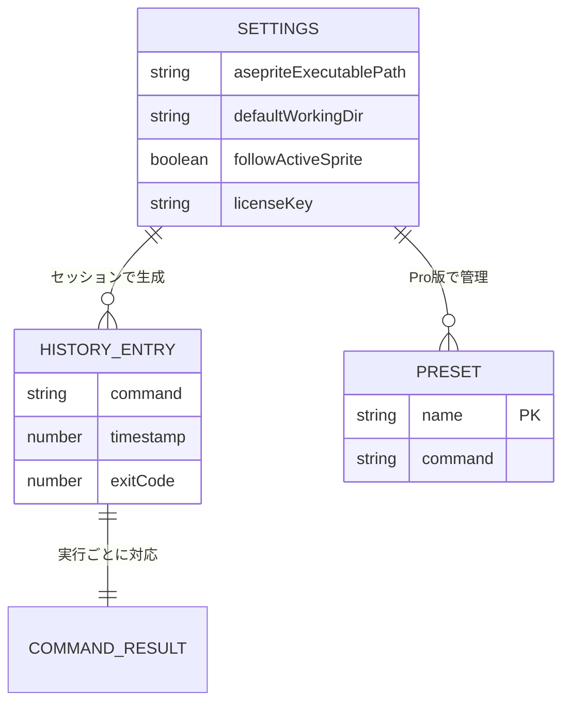
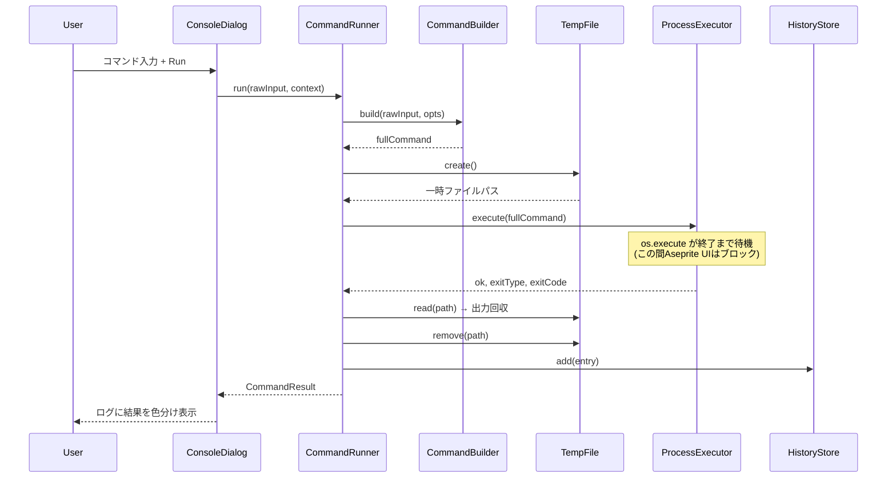
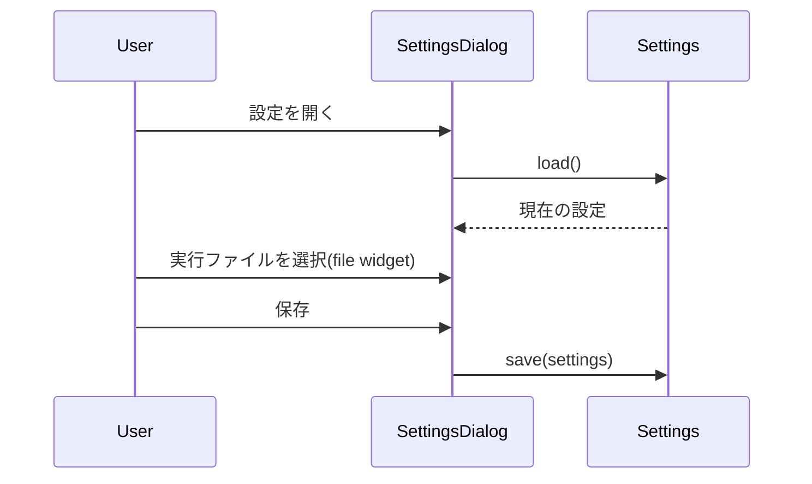
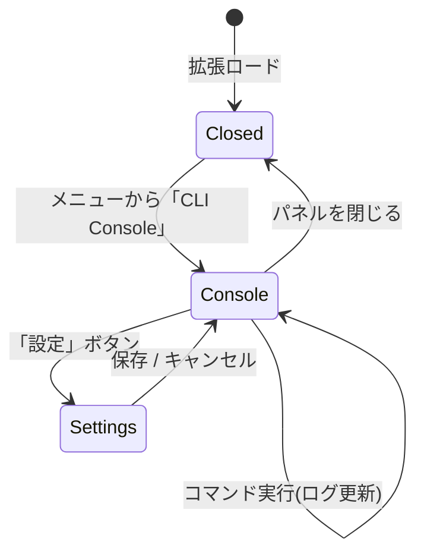

# 機能設計書 (Functional Design Document)

> 本書は `docs/product-requirements.md`(PRD)で定義した「何を作るか」を、
> 「どう実現するか」に落とし込む設計ドキュメントである。
> 対象は MVP(優先度 P0/P1)を中心とする。

## システム構成図

AseCLI は Aseprite 拡張機能(Lua)であり、Aseprite のプロセス内で動作する。
ユーザーが入力したコマンドは `os.execute()` を介して **別プロセス** の
Aseprite(バッチモード)として実行され、その出力は一時ファイル経由で回収する。



## 技術スタック

| 分類 | 技術 | 選定理由 |
|------|------|----------|
| 言語 | Lua 5.4 | Aseprite拡張で唯一サポートされる言語 |
| 実行基盤 | Aseprite Scripting API | Dialog/ファイル/プラグインAPIを提供。`os.execute` で外部コマンド実行 |
| 対象アプリ | Aseprite v1.3.7 以降 | `os.execute` の戻り値が正しく取得できる最初のバージョン |
| 配布形式 | `.aseprite-extension`(ZIP) | Aseprite標準の拡張配布形式。itch.ioで配布 |

> 詳細・バージョン・代替技術の検討は `docs/architecture.md` を参照。

## データモデル定義

Lua にはクラス/型システムがないため、データは **プレーンな Lua テーブル** で表現する。
各テーブルの想定構造を以下に定義する(型名は便宜上の呼称)。

### Settings(拡張機能の永続設定)

```lua
-- 永続化先: plugin.preferences (Asepriteが自動保存)
local Settings = {
  asepriteExecutablePath = "",  -- string  Aseprite実行ファイルの絶対パス
  defaultWorkingDir      = "",  -- string  未保存スプライト時に使う既定の作業ディレクトリ
  followActiveSprite     = true,-- boolean trueなら作業ディレクトリを開いているスプライトのフォルダに追従
  showUnsavedWarning     = true,-- boolean 未保存スプライトへの実行時に警告するか
  licenseKey             = "",  -- string  Pro版ライセンスキー(Pro機能で使用、未使用時は空)
}
```

**制約**:
- `asepriteExecutablePath` が空または不正パスの場合、コマンド実行を拒否しエラー表示する
- `defaultWorkingDir` が空の場合は `app.fs.userDocsPath` を既定値とする

### HistoryEntry(コマンド履歴の1件)

```lua
local HistoryEntry = {
  command   = "",   -- string  ユーザーが入力した生コマンド文字列
  timestamp = 0,    -- number  実行時刻(os.time())
  exitCode  = 0,    -- number  終了コード(成功=0)
  success   = true, -- boolean 成功したか
}
```

**制約**: 履歴は最大100件。上限超過時は古いものから削除(FIFO)。

### CommandResult(コマンド実行結果)

```lua
local CommandResult = {
  rawCommand   = "",    -- string  ユーザー入力の生コマンド
  fullCommand  = "",    -- string  実際に os.execute へ渡した完全なコマンド
  output       = "",    -- string  標準出力+標準エラー出力(一時ファイルから回収)
  exitCode     = 0,     -- number  終了コード
  success      = false, -- boolean exitCode == 0 かつ実行自体が成功
  errorMessage = nil,   -- string|nil 拡張側で検出したエラー(パス未設定等)
  durationMs   = 0,     -- number  実行にかかった時間(ミリ秒)
}
```

### Preset(Pro: 保存済みコマンド)

```lua
-- 永続化先: plugin.preferences
local Preset = {
  name    = "",  -- string  プリセット名(一意)
  command = "",  -- string  保存されたコマンド文字列
}
```

### ER図(エンティティ関連)

本プロダクトはリレーショナルDBを持たないが、データ間の関連は以下のとおり。



## コンポーネント設計

レイヤードアーキテクチャを採用する(詳細は `docs/architecture.md`)。
各 Lua モジュールは関数テーブルを `return` する。依存方向は UI → Core → Infra の一方向。

### UIレイヤー

#### ConsoleDialog(`ui/console-dialog.lua`)

**責務**:
- コマンド入力欄・実行ボタン・出力ログを持つメインパネルの構築と表示
- ユーザー操作(Enter/Runボタン/履歴呼び出し)の受付
- 実行結果の整形表示(成功/失敗の色分け、ログ蓄積)

**インターフェース**:
```lua
local ConsoleDialog = {}
function ConsoleDialog.show() end          -- パネルを構築して表示
function ConsoleDialog.appendLog(result) end -- CommandResult をログ領域へ追記
```

**依存関係**: `core/command-runner`, `core/history-store`, `infra/settings`

#### SettingsDialog(`ui/settings-dialog.lua`)

**責務**: Aseprite実行ファイルパス・作業ディレクトリ・警告ON/OFF等の設定UI

**インターフェース**:
```lua
local SettingsDialog = {}
function SettingsDialog.show() end  -- 設定ダイアログを表示し、保存時に Settings を更新
```

**依存関係**: `infra/settings`

### コアレイヤー

#### CommandBuilder(`core/command-builder.lua`)

**責務**:
- 生コマンド文字列の検証(空チェック等)
- 先頭トークン `aseprite` を、設定済み実行ファイルパス(クオート済み)に置換
- 作業ディレクトリへの移動(`cd /d "dir" &&`)を前置
- 出力リダイレクト(`> "tempfile" 2>&1`)を付加
- OS差異(Windowsのcmdクオート)を吸収

**インターフェース**:
```lua
local CommandBuilder = {}
-- @param rawInput string ユーザー入力
-- @param opts table { executablePath, workingDir, outputFile }
-- @return string|nil fullCommand, string|nil errorMessage
function CommandBuilder.build(rawInput, opts) end
```

**依存関係**: なし(純粋ロジック。単体テスト対象の中心)

#### CommandRunner(`core/command-runner.lua`)

**責務**: コマンド実行の一連の流れを統括する
1. CommandBuilder で完全なコマンドを生成
2. TempFile で出力用一時ファイルを用意
3. ProcessExecutor で実行
4. 一時ファイルから出力を回収し CommandResult を構築
5. 一時ファイルを削除、HistoryStore に記録

**インターフェース**:
```lua
local CommandRunner = {}
-- @param rawInput string
-- @param context table { settings, activeSprite }
-- @return CommandResult
function CommandRunner.run(rawInput, context) end
```

**依存関係**: `core/command-builder`, `core/history-store`, `infra/process-executor`, `infra/temp-file`

#### HistoryStore(`core/history-store.lua`)

**責務**: コマンド履歴の保持・呼び出し(↑↓)・永続化

**インターフェース**:
```lua
local HistoryStore = {}
function HistoryStore.add(entry) end       -- HistoryEntry を追加(FIFO上限100)
function HistoryStore.list() end           -- HistoryEntry の配列を返す
function HistoryStore.recall(direction) end-- "up"/"down" で前後のコマンド文字列を返す
```

**依存関係**: `infra/settings`(永続化に plugin.preferences を利用)

#### LicenseManager(`core/license.lua`)【Pro】

**責務**: Pro機能の有効/無効判定

**インターフェース**:
```lua
local LicenseManager = {}
function LicenseManager.isPro() end  -- boolean。Pro版ビルドまたは有効キーで true
```

**依存関係**: `infra/settings`

#### PresetStore(`core/preset-store.lua`)【Pro】

**責務**: コマンドプリセットの保存・一覧・呼び出し・削除

**インターフェース**:
```lua
local PresetStore = {}
function PresetStore.save(name, command) end
function PresetStore.list() end          -- Preset の配列
function PresetStore.get(name) end       -- Preset|nil
function PresetStore.remove(name) end
```

**依存関係**: `infra/settings`, `core/license`

### インフラレイヤー

#### ProcessExecutor(`infra/process-executor.lua`)

**責務**: `os.execute()` のラッパー。完全なコマンドを実行し終了情報を返す

**インターフェース**:
```lua
local ProcessExecutor = {}
-- @param fullCommand string CommandBuilder が生成した完全なコマンド
-- @return boolean ok, string exitType ("exit"/"signal"), number exitCode
function ProcessExecutor.execute(fullCommand) end
```

**依存関係**: なし(Lua標準 `os` のみ)

#### TempFile(`infra/temp-file.lua`)

**責務**: 出力リダイレクト用の一時ファイルの生成・読み取り・削除

**インターフェース**:
```lua
local TempFile = {}
function TempFile.create() end       -- string パスを返す
function TempFile.read(path) end     -- string 内容を返す
function TempFile.remove(path) end
```

**依存関係**: `app.fs`(Aseprite API), Lua標準 `io`

#### Settings(`infra/settings.lua`)

**責務**: 設定・履歴・プリセットの永続化(Asepriteの `plugin.preferences` を利用)

**インターフェース**:
```lua
local Settings = {}
function Settings.init(plugin) end       -- init(plugin) 時に plugin 参照を保持
function Settings.load() end             -- Settings テーブルを返す
function Settings.save(settings) end
function Settings.get(key) end
function Settings.set(key, value) end
```

**依存関係**: `plugin.preferences`(Aseprite API)

## ユースケース図

### ユースケース1: コマンドの実行



**フロー説明**:
1. ユーザーがコマンドを入力し Run(または Enter)を押す
2. CommandRunner が CommandBuilder で完全なコマンドを生成(パス置換・cd前置・リダイレクト付加)
3. 一時ファイルを用意し ProcessExecutor が `os.execute` で実行(初回はAsepriteのセキュリティ許可ダイアログが表示される)
4. 出力を一時ファイルから回収し、終了コードと併せて CommandResult を構築
5. 履歴に記録し、結果をパネルのログへ色分け表示

### ユースケース2: 実行ファイルパスの設定



## 画面遷移図



## UI設計

### コンソールパネル レイアウト

Aseprite の `Dialog` API には複数行テキスト欄が無いため、出力ログは
複数の `label` 行、または `canvas` ウィジェットへの自前描画で表現する
(MVPは `label` 方式、見栄えを高める場合は `canvas` 方式を後続で検討)。

```
┌─ AseCLI Console ───────────────────────────┐
│ 作業ディレクトリ: C:\work\sprites           │
│ コマンド: [ aseprite -b in.ase --sheet ...] │
│           [ Run ]  [ 履歴▼ ]  [ 設定 ]      │
│ ───────────────────────────────────────── │
│ > aseprite -b in.ase --sheet out.png        │
│ ✓ Done (exit 0)  120ms                      │
│ out.png (512x512) を出力しました             │
│ ───────────────────────────────────────── │
│ > aseprite -b broken.ase ...                │
│ ✗ Failed (exit 1)                           │
│ Error: file not found                        │
└─────────────────────────────────────────────┘
```

### 表示項目

| 項目 | 説明 | フォーマット |
|------|------|-------------|
| 作業ディレクトリ | 現在のコマンド実行ディレクトリ | 絶対パス |
| コマンド入力欄 | 実行するコマンド | 1行テキスト(`entry`) |
| 実行コマンド行 | ログ中、実行した生コマンド | `> ` 接頭辞 |
| 結果行 | 成功/失敗と終了コード・所要時間 | `✓ Done` / `✗ Failed` |
| 出力 | 標準出力+標準エラー出力 | プレーンテキスト |

### カラーコーディング

- **緑**: 成功(exit code 0)
- **赤**: 失敗(exit code 非0、または拡張側エラー)
- **グレー**: 実行したコマンド文字列(エコー)
- **黄**: 警告(未保存スプライトへの実行など)

### インタラクティブ操作

1. 入力欄でコマンドを編集 → Enter または Run ボタンで実行
2. ↑/↓ キーまたは「履歴▼」で過去コマンドを呼び出し
3. 実行中は Run ボタンを無効化し「実行中...」を表示(UIブロック中の誤認防止)

## ファイル構造

### データ永続化

設定・履歴・プリセットは Aseprite の `plugin.preferences` テーブルに保存する。
Aseprite がプラグイン単位で自動的に永続化するため、独自ファイルは不要。

```lua
-- plugin.preferences の構造(概念)
plugin.preferences = {
  settings = { asepriteExecutablePath = "...", defaultWorkingDir = "...", ... },
  history  = { { command = "...", timestamp = 1700000000, exitCode = 0 }, ... },
  presets  = { { name = "sheet", command = "aseprite -b ..." }, ... },  -- Pro
}
```

### 一時ファイル

コマンド出力のリダイレクト先。実行ごとに作成し、回収後ただちに削除する。

```
<app.fs.tempPath>/asecli-output-<乱数>.txt
```

## パフォーマンス最適化

- **ログの上限管理**: 出力ログは表示行数に上限を設け、超過分は古い行から破棄(`label`方式の肥大化防止)
- **履歴の上限**: 履歴は100件でFIFO。`plugin.preferences` の肥大化を防ぐ
- **一時ファイルの即時削除**: 実行完了後すぐに削除し、ディスク残留を防ぐ

## セキュリティ考慮事項

- **任意コマンド実行の前提**: 入力されたコマンドはユーザー自身の責任で実行される。拡張はユーザーが Run を押した時のみ実行する
- **Asepriteの許可モデルの尊重**: `os.execute` 実行時に表示される許可ダイアログを回避しない。初回オンボーディングで意味を説明する
- **コマンドのサニタイズ**: 拡張が付加する部分(実行ファイルパス・一時ファイルパス・cd)は適切にクオートし、ユーザー入力の意図しない分割・注入を防ぐ
- **機密情報を扱わない**: ライセンスキー以外の機密情報を保持せず、ネットワーク送信も行わない

## エラーハンドリング

### エラーの分類

| エラー種別 | 処理 | ユーザーへの表示 |
|-----------|------|-----------------|
| コマンド未入力 | 実行せず中断 | 「コマンドを入力してください」 |
| 実行ファイルパス未設定/不正 | 実行せず中断、設定誘導 | 「Aseprite実行ファイルのパスが未設定です。設定を開いてください」 |
| 作業ディレクトリが存在しない | 実行せず中断 | 「作業ディレクトリが見つかりません: <path>」 |
| 一時ファイル作成失敗 | 実行を中断 | 「一時ファイルを作成できませんでした」 |
| コマンドが非0終了 | 結果を失敗として表示 | 「✗ Failed (exit N)」+ 出力内容 |
| `os.execute` が nil を返す | バージョン不足の可能性を案内 | 「実行に失敗しました。Aseprite v1.3.7 以降が必要です」 |
| Pro機能を無料版で使用 | 実行せずアップグレード誘導 | 「この機能はPro版でご利用いただけます」 |

## テスト戦略

Aseprite拡張は Aseprite ランタイムに依存するため、テストを2層に分ける。

### ユニットテスト(Asepriteランタイム外)

- **対象**: 純粋ロジックのモジュール — `CommandBuilder`(パス置換・クオート・cd前置・リダイレクト付加)、`HistoryStore`(FIFO・recall)
- **方法**: Lua標準実行環境 + テストフレームワーク(busted)。Aseprite API(`app`, `plugin` 等)はモックで差し替える
- **重点**: Windowsのcmdクオート、空パス・スペース入りパス、履歴の上限/境界

### 統合テスト(Aseprite実機)

- **対象**: `ProcessExecutor` / `CommandRunner` / UIダイアログ
- **方法**: Aseprite v1.3.7 実機に拡張をインストールし、手動シナリオで確認(`os.execute`・一時ファイル・許可ダイアログは実機でしか検証できないため)

### 受け入れシナリオ(手動E2E)

- スプライトシート書き出しコマンドが成功し、出力ファイルが生成される
- 存在しないファイルを指定したコマンドが失敗として正しく表示される
- 実行ファイルパス未設定時に適切なエラーと設定誘導が出る
- 履歴の ↑↓ 呼び出しが機能する
