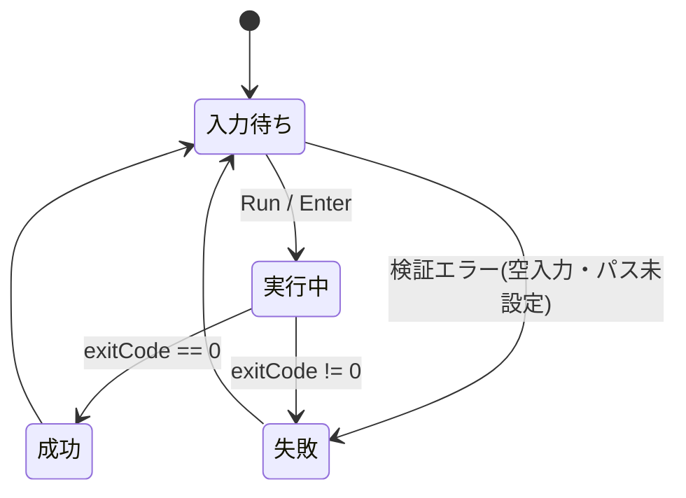

# プロジェクト用語集 (Glossary)

## 概要

このドキュメントは、AseCLI プロジェクトで使用される用語の定義を管理する。
全ドキュメント(PRD・機能設計書・技術仕様書・リポジトリ構造定義書・開発ガイドライン)で
用語を統一的に使用するための基準とする。

**更新日**: 2026-05-22

---

## ドメイン用語

プロジェクト固有のビジネス概念や機能に関する用語。

### AseCLI

**定義**: 本プロジェクトで開発する Aseprite 拡張機能の名称(仮称)。
Aseprite の画面内から Aseprite の CLI コマンドを実行できるコンソールを提供する。

**説明**: ドット絵ツール Aseprite には GUI から実行できない CLI 専用の操作が
多く存在する。AseCLI はそれらを Aseprite を離れずに実行可能にする。

**関連用語**: [コンソールパネル](#コンソールパネル)、[Aseprite CLI](#aseprite-cli)、[拡張機能](#拡張機能-extension)

**英語表記**: AseCLI

### コンソールパネル

**定義**: ユーザーがコマンドを入力・実行し、結果を確認するための AseCLI のメイン UI。

**説明**: コマンド入力欄(1行)、実行ボタン、出力ログ領域、設定・履歴へのアクセスを持つ。
Aseprite の `Dialog` API で構築される擬似ターミナルである。

**関連用語**: [Dialog API](#dialog-api)、[擬似ターミナル](#擬似ターミナル)

**実装**: `src/ui/console-dialog.lua`

### 生コマンド

**定義**: ユーザーがコンソールパネルに入力する、加工前のコマンド文字列。

**説明**: 通常 `aseprite` で始まる(例: `aseprite -b in.ase --sheet out.png`)。
先頭の `aseprite` トークンは実行時に設定済みの実行ファイルパスへ置換される。

**関連用語**: [完全なコマンド](#完全なコマンド)、[トークン置換](#トークン置換)

### 完全なコマンド

**定義**: 生コマンドを加工し、実際に `os.execute` へ渡される最終的なコマンド文字列。

**説明**: 生コマンドに対し、(1)`aseprite` トークンの実行ファイルパスへの置換、
(2)作業ディレクトリへの `cd` 前置、(3)出力リダイレクト(`> tempfile 2>&1`)の付加、
(4)OS依存のクオート処理、を施したもの。

**関連用語**: [生コマンド](#生コマンド)、[CommandBuilder](#commandbuilder)

### トークン置換

**定義**: 生コマンド先頭の `aseprite` という語を、設定された Aseprite 実行ファイルの
絶対パス(クオート済み)に置き換える処理。

**説明**: ユーザーは `aseprite XXX` と直感的に書け、拡張側が環境依存のパスを補う。

**実装**: `src/core/command-builder.lua`

### 擬似ターミナル

**定義**: 本物のターミナルエミュレータではなく、「コマンド入力欄+実行+出力表示」で
ターミナルに近い操作感を再現した UI。

**説明**: Aseprite の `Dialog` API には対話的シェルや複数行入力欄が無いため、
AseCLI は単発コマンドの実行と結果表示に限定した擬似的な実装とする。

**関連用語**: [コンソールパネル](#コンソールパネル)

### コマンドプリセット

**定義**: よく使うコマンドに名前を付けて保存し、再利用できるようにした項目。【Pro機能】

**説明**: 繰り返す書き出し作業を効率化するための Pro 版限定機能。

**関連用語**: [Pro版](#pro版)、[フリーミアム](#フリーミアム)

**実装**: `src/core/preset-store.lua`

### フリーミアム

**定義**: 基本機能を無料で提供し、追加機能を有料(Pro版)とする収益モデル。

**説明**: 無料版は単一コマンドの実行・出力表示・履歴を提供する。
Pro版はコマンドプリセット等を追加で提供する。MVPでは無料版とPro版を
itch.io 上で別ダウンロードとして配布する。

**関連用語**: [Pro版](#pro版)

### Pro版

**定義**: フリーミアムにおける有料版の AseCLI。

**説明**: コマンドプリセット等の追加機能を含む。`LicenseManager.isPro()` が
`true` を返すビルドとして配布される。

**関連用語**: [フリーミアム](#フリーミアム)、[LicenseManager](#licensemanager)

---

## 技術用語

プロジェクトで使用している技術・ツールに関する用語。

### Aseprite

**定義**: ドット絵・ピクセルアートの制作およびアニメーション作成に特化した有償の画像エディタ。

**公式サイト**: https://www.aseprite.org/

**本プロジェクトでの用途**: AseCLI が拡張機能として動作する対象アプリケーション。

**バージョン**: v1.3.7 以降を動作対象とする

### Aseprite CLI

**定義**: Aseprite が提供するコマンドラインインターフェース。
`aseprite` 実行ファイルをコマンドライン引数付きで起動して各種処理を行う。

**公式サイト**: https://www.aseprite.org/docs/cli/

**本プロジェクトでの用途**: AseCLI が画面内から実行する対象。スプライトシート生成・
フォーマット変換・リサイズなど、GUI に代替手段が無い操作を担う。

**説明**: `-b`(バッチモード)を付けると UI を起動せずディスク上のファイルを処理する。
CLI は常に新しいプロセスを起動し、編集中(メモリ上)のスプライトには作用しない。

**関連用語**: [バッチモード](#バッチモード)、[Run Command 窓](#run-command-窓)

### Lua

**定義**: 軽量な手続き型スクリプト言語。

**公式サイト**: https://www.lua.org/

**本プロジェクトでの用途**: AseCLI の実装言語。Aseprite 拡張は Lua のみで記述できる。

**バージョン**: 5.4(Aseprite に組み込み)

**選定理由**: Aseprite 拡張で唯一サポートされる言語であり、選択の余地はない。

### Aseprite Scripting API

**定義**: Aseprite が Lua スクリプトに公開している API 群。

**公式サイト**: https://www.aseprite.org/api/

**本プロジェクトでの用途**: `Dialog`(UI構築)、`app.fs`(ファイルパス)、
`plugin`(コマンド登録・設定永続化)などを利用する。

### Dialog API

**定義**: Aseprite Scripting API のうち、ダイアログUIを構築するためのAPI。

**本プロジェクトでの用途**: コンソールパネルと設定ダイアログの構築。

**説明**: 利用できるウィジェットは `entry`(1行入力)、`label`、`button`、
`combobox`、`canvas`(自前描画)等。**複数行テキスト入力欄や本物のターミナル
ウィジェットは存在しない**ため、出力ログは `label` 群または `canvas` で表現する。

**関連用語**: [擬似ターミナル](#擬似ターミナル)

### os.execute

**定義**: Lua 標準ライブラリ `os` の関数。外部コマンドをOSのシェル経由で実行する。

**本プロジェクトでの用途**: Aseprite CLI を別プロセスとして起動する中核手段。

**説明**: Aseprite はセキュリティのため `os.execute` をラッパーで上書きしており、
実行時に許可ダイアログを表示する。**v1.3.6 以前はラッパーが戻り値を返さず `nil` に
なる不具合があり、v1.3.7 で修正された**。本プロジェクトが v1.3.7 を最小要件とする
根拠である。同期実行のため、実行中は Aseprite の UI がブロックされる。

**関連用語**: [セキュリティ許可ダイアログ](#セキュリティ許可ダイアログ)、[一時ファイル](#一時ファイル)

**実装(ラッパー)**: `src/infra/process-executor.lua`

### plugin.preferences

**定義**: Aseprite Plugin API が提供する、プラグイン単位の永続設定テーブル。

**本プロジェクトでの用途**: 設定(Settings)・コマンド履歴・プリセットの永続化先。

**説明**: Aseprite がプラグイン単位で自動的に保存・復元するため、独自の設定ファイル
管理が不要になる。

**実装**: `src/infra/settings.lua` に集約

### 一時ファイル

**定義**: コマンドの標準出力・標準エラー出力をリダイレクトして回収するための一時的なファイル。

**本プロジェクトでの用途**: `os.execute` は出力を直接返さず、`io.popen` も Aseprite 環境で
不安定なため、出力を一時ファイルにリダイレクト(`> tempfile 2>&1`)して読み戻す。

**説明**: `<app.fs.tempPath>/asecli-output-<乱数>.txt` に作成し、回収後ただちに削除する。

**実装**: `src/infra/temp-file.lua`

### busted

**定義**: Lua 用のユニットテストフレームワーク。

**公式サイト**: https://lunarmodules.github.io/busted/

**本プロジェクトでの用途**: Asepriteランタイム外で純粋ロジック(`CommandBuilder` 等)を
テストする。Aseprite API はモックで差し替える。

**バージョン**: 2.x(開発時のみ。配布物には含めない)

### luacheck

**定義**: Lua 用の静的解析・Linter。

**本プロジェクトでの用途**: 未定義グローバル・未使用変数の検出。グローバル変数の
混入を防ぐ。

**バージョン**: 0.26+ (開発時のみ)

### .aseprite-extension

**定義**: Aseprite 拡張機能の配布形式。`package.json` を含む ZIP アーカイブ。

**本プロジェクトでの用途**: AseCLI の配布パッケージ形式。`scripts/build.ps1` が生成する。

**説明**: ユーザーは Aseprite の Preferences > Extensions からこのファイルを
インストールする。itch.io 経由で配布する。

---

## 略語・頭字語

### CLI

**正式名称**: Command Line Interface

**意味**: コマンドラインから操作するインターフェース。

**本プロジェクトでの使用**: 「Aseprite CLI」= Aseprite のコマンドライン機能。
本プロダクト名 AseCLI の "CLI" もこれに由来する。

### GUI

**正式名称**: Graphical User Interface

**意味**: 画面上の視覚的な要素で操作するインターフェース。

**本プロジェクトでの使用**: Aseprite の通常の画面操作を指す。
「GUI に代替手段が無い CLI 操作」が AseCLI の価値の源泉。

### PRD

**正式名称**: Product Requirements Document

**意味**: プロダクト要求定義書。「何を作るか」を定義する。

**本プロジェクトでの使用**: `docs/product-requirements.md`

### MVP

**正式名称**: Minimum Viable Product

**意味**: 実用に足る最小限の機能セットを持つプロダクト。

**本プロジェクトでの使用**: 優先度 P0/P1 の機能で構成する初回リリース範囲。

### FIFO

**正式名称**: First In, First Out

**意味**: 先に入れたものから先に取り出す方式。

**本プロジェクトでの使用**: コマンド履歴の上限管理(100件超過時、古いものから削除)。

---

## アーキテクチャ用語

### レイヤードアーキテクチャ

**定義**: システムを役割ごとの層に分割し、上位層から下位層への一方向の依存に保つ設計パターン。

**本プロジェクトでの適用**: 3層構成を採用する。

```
UIレイヤー (ui/)      ← Dialog構築・操作受付・結果表示
    ↓
コアレイヤー (core/)  ← コマンド生成・実行統括・履歴・Pro機能
    ↓
インフラレイヤー (infra/) ← os.execute・一時ファイル・設定永続化
```

**メリット**: 関心の分離、テスト容易性、将来のUI差し替え(フォーム型ランチャー)への対応。

**依存関係のルール**:
- ✅ UI → Core → Infra
- ❌ Infra → Core / Core → UI などの逆方向・飛び越し

**参考**: [技術仕様書](./architecture.md)、[リポジトリ構造定義書](./repository-structure.md)

### バッチモード

**定義**: Aseprite CLI のオプション `-b`(`--batch`)。UI を起動せずに処理を実行するモード。

**本プロジェクトでの適用**: AseCLI が実行するコマンドの中心。ディスク上のファイルに
対する書き出し・変換等を、UI を伴わない別プロセスで実行する。

**関連用語**: [Aseprite CLI](#aseprite-cli)

### Run Command 窓

**定義**: Aseprite 標準機能。`Ctrl+Space` で開き、内部コマンドや インライン Lua を実行できる。

**本プロジェクトでの位置づけ**: AseCLI の **間接競合**(機能の一部が重複する標準機能)。
ただし Run Command 窓は内部コマンド(`app.command`)向けであり、CLI バッチ操作
(`aseprite -b`)は扱えない。AseCLI はこの CLI バッチ操作に価値を絞ることで差別化する。

**関連用語**: [Aseprite CLI](#aseprite-cli)、[内部アプリコマンド](#内部アプリコマンド)

### 内部アプリコマンド

**定義**: Aseprite の `app.command.*` でアクセスできる内部機能(メニュー項目に相当)。

**本プロジェクトでの位置づけ**: **スコープ外**。Run Command 窓と重複するため、
AseCLI は扱わない。AseCLI が扱うのは CLI(`aseprite -b ...`)である。

---

## ステータス・状態

### コマンド実行状態

**定義**: 1回のコマンド実行が取りうる状態。

| 状態 | 意味 | 遷移条件 |
|------|------|---------|
| 入力待ち | コマンド入力欄が編集可能 | 初期状態、または実行完了後 |
| 実行中 | `os.execute` が処理中。UIブロック中 | Run/Enter 押下後 |
| 成功 | 終了コード 0 で完了 | 実行完了かつ exitCode == 0 |
| 失敗 | 非0終了、または拡張側エラー | 実行完了かつ exitCode != 0、または検証エラー |

**状態遷移図**:


---

## データモデル用語

### Settings

**定義**: 拡張機能の永続設定を保持するデータ。

**主要フィールド**:
- `asepriteExecutablePath`: Aseprite 実行ファイルの絶対パス
- `defaultWorkingDir`: 既定の作業ディレクトリ
- `followActiveSprite`: 作業ディレクトリを開いているスプライトに追従するか
- `showUnsavedWarning`: 未保存スプライトへの実行時に警告するか

**永続化先**: `plugin.preferences`

### HistoryEntry

**定義**: コマンド履歴の1件を表すデータ。

**主要フィールド**: `command`、`timestamp`、`exitCode`、`success`

**制約**: 履歴は最大100件(FIFO)。

### CommandResult

**定義**: 1回のコマンド実行結果を表すデータ。

**主要フィールド**: `rawCommand`、`fullCommand`、`output`、`exitCode`、
`success`、`errorMessage`、`durationMs`

### Preset

**定義**: 保存済みコマンドプリセットを表すデータ。【Pro】

**主要フィールド**: `name`(一意)、`command`

---

## コンポーネント用語

### CommandBuilder

**定義**: 生コマンドから完全なコマンドを生成するコアモジュール。

**説明**: トークン置換・`cd` 前置・出力リダイレクト付加・OS依存クオートを担う。
純粋ロジックであり、ユニットテストの中心対象。

**実装**: `src/core/command-builder.lua`

### CommandRunner

**定義**: コマンド実行フロー全体を統括するコアモジュール。

**説明**: CommandBuilder → TempFile → ProcessExecutor → 出力回収 → HistoryStore 記録、
の一連を実行し `CommandResult` を返す。

**実装**: `src/core/command-runner.lua`

### ProcessExecutor

**定義**: `os.execute` をラップするインフラモジュール。

**説明**: 完全なコマンドを実行し、成否・終了タイプ・終了コードを返す。
`os.execute` を直接呼ぶのは本モジュールのみ。

**実装**: `src/infra/process-executor.lua`

### LicenseManager

**定義**: Pro 機能の有効/無効を判定するコアモジュール。【Pro】

**説明**: `isPro()` で Pro 版かどうかを返す。Pro 機能はこの判定で一元的にゲートする。

**実装**: `src/core/license.lua`

---

## エラー・例外

Lua には例外クラスが無く、本プロジェクトはエラーを **戻り値**(`value, errorMessage`)で
表現する。代表的なエラーケースを示す。

### 入力検証エラー

**発生条件**: コマンド未入力、実行ファイルパス未設定/不正、作業ディレクトリ不在。

**対処方法**:
- ユーザー: メッセージに従い入力・設定を修正する
- 開発者: `CommandBuilder` / `CommandRunner` の検証ロジックを確認する

**表示例**: 「Aseprite実行ファイルのパスが未設定です。設定を開いてください」

### 実行失敗エラー

**発生条件**: コマンドが非0の終了コードで終了した。

**対処方法**:
- ユーザー: 出力ログのエラー内容を確認しコマンドを修正する
- 開発者: 終了コードと出力が正しく回収・表示されているか確認する

**表示例**: 「✗ Failed (exit 1)」+ コマンド出力

### 実行不能エラー(バージョン不足)

**発生条件**: `os.execute` が `nil` を返す(Aseprite v1.3.6 以前の可能性)。

**対処方法**:
- ユーザー: Aseprite を v1.3.7 以降に更新する
- 開発者: 動作要件のバージョンチェックを確認する

**表示例**: 「実行に失敗しました。Aseprite v1.3.7 以降が必要です」

### Pro機能制限エラー

**発生条件**: 無料版で Pro 機能(コマンドプリセット等)を使用しようとした。

**対処方法**:
- ユーザー: Pro 版へアップグレードする
- 開発者: `LicenseManager.isPro()` によるゲートを確認する

**表示例**: 「この機能はPro版でご利用いただけます」

---

## その他の用語

### セキュリティ許可ダイアログ

**定義**: スクリプトが `os.execute` 等の危険な操作を行う際に Aseprite が表示する許可確認。

**説明**: ユーザーが「完全に信頼する(Give full trust)」を選ぶと以降は抑制される。
AseCLI はこのダイアログを回避・抑制せず、初回オンボーディングで意味を説明する。

### ステアリングファイル

**定義**: 特定の開発作業における「今回何をするか」を定義する一時ドキュメント。

**説明**: `.steering/[YYYYMMDD]-[task-name]/` に `requirements.md` / `design.md` /
`tasklist.md` を配置する。永続ドキュメント(`docs/`)とは区別される。

**英語表記**: Steering File

### 永続ドキュメント

**定義**: アプリケーション全体の「何を作るか/どう作るか」を定義する長期保存ドキュメント。

**説明**: `docs/` 配下の6文書(PRD・機能設計書・技術仕様書・リポジトリ構造定義書・
開発ガイドライン・用語集)。プロジェクトの「北極星」として機能する。
